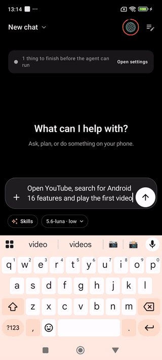
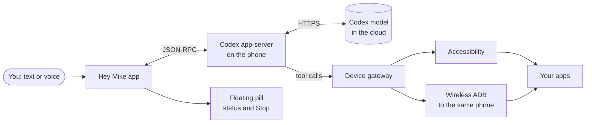

# Hey Mike

**Mike is an AI agent that lives on your Android phone and uses it for you.**

Tell Mike what you want, typed or spoken. It reads the screen, taps, types,
scrolls and opens apps on the same phone. You watch every step and can stop it
at any moment.

<p>
  <a href="https://github.com/Yoni-Raich/hey-mike/releases/latest"></a>
</p>

[](https://github.com/Yoni-Raich/hey-mike/releases/latest)


[](LICENSE)
[](LICENSE-COMMERCIAL.md)

<p align="center">
  
  <br>
  <em>“Open YouTube, search for Android 16 features and play the first video.”<br>A real screen recording of the agent on a phone, at 2× speed.</em>
</p>

- [1. Download and install](#1-download-and-install)
- [2. Set up the app](#2-set-up-the-app)
- [3. Use it](#3-use-it)
- [Good to know](#good-to-know)
- [For developers](#for-developers)

---

## 1. Download and install

**You need:** an Android phone with Android 11 or newer (ARM64, which is almost
every phone today), and a ChatGPT account with Codex access.

1. On your phone, open the
   **[latest release](https://github.com/Yoni-Raich/hey-mike/releases/latest)**.
2. Under **Assets**, tap the `.apk` file to download it.
3. Open the downloaded file and tap **Install**. If Android asks, allow your
   browser or file manager to install unknown apps.

> [!IMPORTANT]
> ### Google Play Protect will probably block the install
>
> Play Protect blocks apps that come from outside Google Play and ask for
> sensitive permissions. Hey Mike needs **Accessibility**, the permission
> that lets it see and tap the screen, so Play Protect treats it as risky, even
> though it is not. You may see *"App blocked"* or *"Unsafe app blocked"*.
>
> - If the warning offers **Install anyway**, tap it.
> - If it doesn't, turn Play Protect scanning off **for the install only**:
>   1. Open the **Google Play Store** app.
>   2. Tap your **profile icon** (top right) → **Play Protect** → **Settings** ⚙.
>   3. Turn off **Scan apps with Play Protect**.
>   4. Install the APK.
>   5. **Go back and turn Play Protect on again.**
>
> Only do this for an APK you downloaded from this repository's
> [Releases](https://github.com/Yoni-Raich/hey-mike/releases/latest)
> page. Each release lists the file's SHA-256 so you can check it.

## 2. Set up the app

1. **Open Hey Mike and sign in.** The app shows a code; confirm it with
   your ChatGPT account. No API key is needed.
2. **Turn on Accessibility.** With the app open, go to *Settings →
   Accessibility → Hey Mike* and turn it on. This lets the agent see and
   control the screen.
   - **Greyed out?** Android 13+ restricts this for apps installed outside
     Google Play. Go to *Settings → Apps → Hey Mike*, tap **⋮** (top right)
     → **Allow restricted settings**, then try again.
3. **Allow "Display over other apps"** so the floating status pill with the
   **Stop** button can stay on screen while the agent works (recommended).
4. **Optional:** the microphone for voice mode, notifications, and Wireless
   Debugging pairing for extra tools (shell, files, APK install).

The app's setup screen shows what is ready and what is missing.

## 3. Use it

**Give it a task.** Type what you want and tap send, or tap the voice button
when the field is empty to talk. For example:

- *"Open Settings and tell me which Android version I have."*
- *"Get Danny's address from WhatsApp and start navigation to it in Maps."*
- *"Find the latest video from my favourite channel on YouTube and play it."*

Start with something small to see how it works.

**Watch it work.** The agent looks at the screen, does one thing, looks again
and continues. A floating pill at the top of the screen shows what it is doing
right now ("Reading the screen", "Tapping"). In the chat, its steps fold into
one row, such as "5 actions on your phone", that you can open.

**Stay in control:**

- **Stop:** tap **Stop** on the floating pill or in the app. The agent stops
  right away.
- **Steer:** send a message while it works, or tap the pill and type, to
  correct it mid-task ("not that one, the second contact").
- **Approve:** for some actions, like sending a message with prefilled text,
  the agent waits for you to approve in the app.

**More features:**

- **Voice mode:** a full-screen live conversation. You can mute the mic
  without ending it.
- **Skills and commands:** type `/` or tap the **Skills** chip to pick a skill
  or a command: *New chat*, *Compact*, *Plan mode*, *Model*, *Rename*, *Status*.
  In Plan mode the agent proposes a plan before it acts.
- **Model and reasoning:** tap the chip under the text field.
- **Hebrew and Arabic** lines show right to left.
- **Updates:** the app can check for a newer release and download it. Android
  still asks you to confirm the install, and Play Protect may block it again
  (see above).

## Good to know

> [!WARNING]
> **This is a Developer Preview.** Expect rough edges. The APK is signed with a
> test key, and not every feature has been tested on every phone.

- **Your data goes to the cloud while a task runs.** The agent runs on your
  phone, but the model is OpenAI's Codex service. Your messages, the screen
  text the agent reads, and screenshots when it needs them are sent to it.
  Sessions and settings are stored only on the phone.
- **Keep secrets off the screen** while the agent works, and don't let it
  handle passwords or payments.
- **Screens can lie.** A web page or message can contain text that tries to
  steer the agent. Watch what it does and use Stop if something looks wrong.
- **Stop can't undo.** It prevents further actions, but a message that was
  already sent stays sent.
- **One task at a time** per phone.
- **Emulators don't work yet.** Use a real ARM64 phone.
- **From 2027, Google plans to require verified developers** for apps installed
  outside Google Play, starting with some countries on September 30, 2026.
  Installing apps from unverified developers will then need Android's one-time
  [advanced flow](https://android-developers.googleblog.com/2026/03/android-developer-verification.html).

More: [Permissions and privacy](docs/PERMISSIONS_AND_PRIVACY.md) ·
[Known issues](docs/KNOWN_ISSUES.md) · [Changelog](CHANGELOG.md)

Found a bug? [Open an issue](https://github.com/Yoni-Raich/hey-mike/issues).
Please don't include passwords, pairing codes, tokens or screenshots with
private information. To report a security problem, see [SECURITY.md](SECURITY.md).

---

## For developers

### How it works



- The app runs the official Codex app-server binary on the phone and talks to
  it over JSON-RPC. The UI shows app events, never raw model output.
- Every device action goes through one gateway, which knows which tools are
  available, shows the control state and enforces Stop. Stop blocks new
  actions first, then interrupts the one in progress.
- Modules: `app`, `core`, `engine-codex`, `runtime`, `workspace`, `adb`,
  `a11y`, `device-tools`, `overlay`, `voice`. See
  [Architecture](docs/ARCHITECTURE.md).

### Build from source

You need Git, JDK 17, Python 3, and the Android SDK with platform tools.

```bash
git clone https://github.com/Yoni-Raich/hey-mike.git
cd hey-mike
./gradlew :app:assembleDevDebug
```

On Windows, use `.\gradlew.bat :app:assembleDevDebug`. The first build
downloads the pinned Codex app-server and CA bundle and checks their hashes.
Install on a chosen device:

```bash
adb -s <serial> install -r app/build/outputs/apk/dev/debug/app-dev-debug.apk
```

See [Getting started](docs/GETTING_STARTED.md), [Testing](docs/TESTING.md),
[Release process](docs/RELEASES.md) and [PROGRESS.md](PROGRESS.md).

### Contributing

Pull requests and device reports are welcome. Read
[CONTRIBUTING.md](CONTRIBUTING.md) and the
[Code of Conduct](CODE_OF_CONDUCT.md) first.

### License

Hey Mike is dual-licensed.

- **[GNU AGPL v3.0](LICENSE)** — free for personal use, study, research, and any
  project willing to release its own complete source under the same license. If
  you distribute a modified build, or offer it over a network, you must publish
  your corresponding source (AGPL section 13).
- **[Commercial license](LICENSE-COMMERCIAL.md)** — required to ship Hey Mike or
  a derivative inside a closed-source or proprietary product, or to obtain
  support, a warranty, or an indemnity. Contact yoniraich@gmail.com.

Contributions are accepted under the [CLA](CLA.md).

Bundled and downloaded third-party components keep their own licenses and are
not covered by either option; see [NOTICE](NOTICE) and the
[Codex app-server license](third_party/licenses/openai-codex-app-server-0.156.0-Apache-2.0.txt).

Hey Mike is an independent project and is not affiliated with or endorsed
by OpenAI or Google. All docs: [docs/INDEX.md](docs/INDEX.md).
