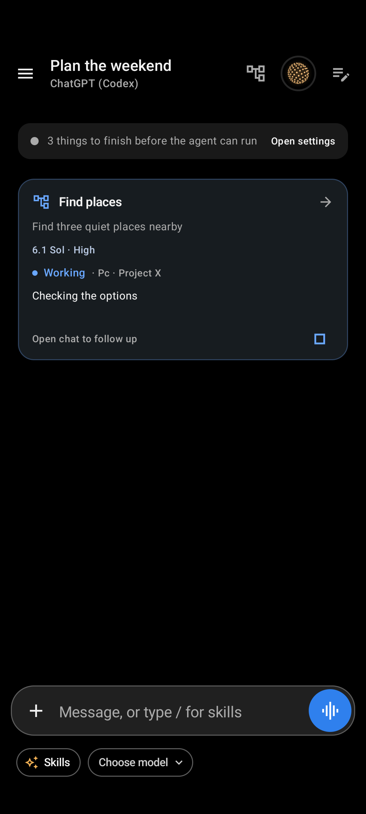
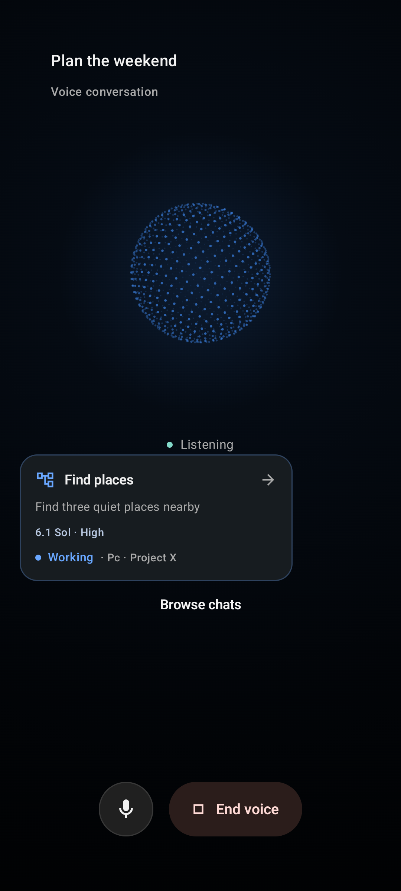
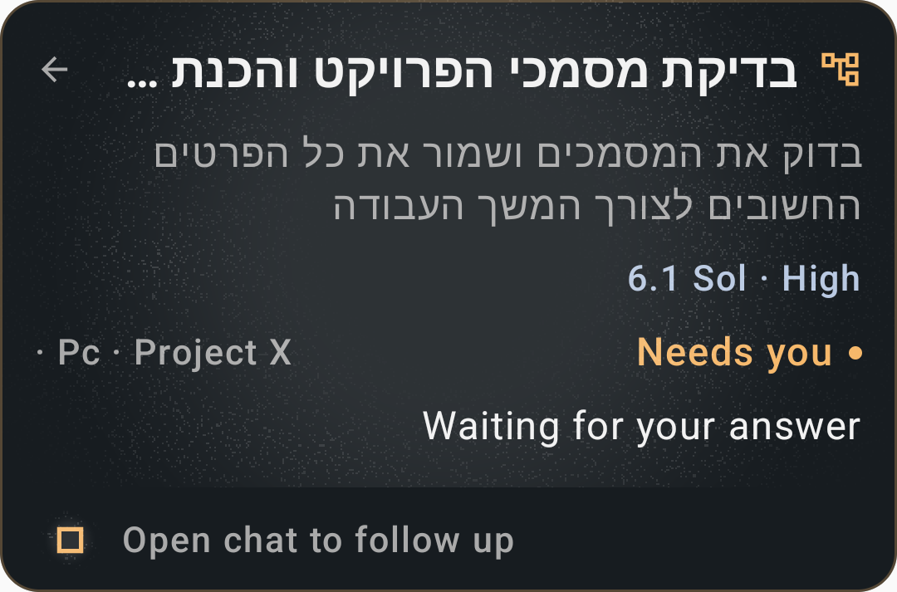

# Session subagents and voice — 2026-10-11

## Result

Children run as ordinary Mike chats. A parent can select their engine, model,
reasoning effort and saved computer/project, read progress, steer the same chat,
cancel its subtree or open it. The user can continue a child directly. Parent
metadata and receipts survive restart. Voice uses the same protocol and can
browse other chats while its source connection stays active.

Worktree: `feat/session-subagents-voice-20261011`, based on clean `origin/dev`
`6692067402dba86841ef35c20fdad450166243bf`. The existing checkout was left intact.

## Checks

| Area | Evidence |
|---|---|
| Full build gate | `gradlew.bat test assembleDevRelease assembleDevDebug assembleDevDebugAndroidTest :voice:lintDebug :app:lintDevDebug --no-daemon --no-parallel --max-workers=2`: successful in 1m30s, 1,168 tasks. |
| Unit variants | 2,372 XML test executions, zero failures/errors, 16 skips. These are executions across variants, not 2,372 unique tests. |
| Runtime preparation | `python -m unittest tools.test_prepare_runtime`: 15 passed. |
| UI | Own API 35 x86_64 emulator, manual `install -r` and `am instrument -w -e package dev.androidagent.app.ui dev.androidagent.app.dev.test/androidx.test.runner.AndroidJUnitRunner`: 33 passed in 48.015s. |
| Source hygiene | `git diff --check` passed. No lint baseline or gate weakening. |
| Package | `dev.androidagent.app.dev`, Dev Debug, 1129, `0.14.0-dev.subagents1`. APK Signature Scheme v2, debug key; `zipalign -c -P 16 4` passed. |
| Exact install | Xiaomi Redmi 12 (23053RN02Y), Android 15, deliberately selected USB serial. `adb install -r`: success; package metadata and installed APK SHA match. |
| Upgrade | Private tar and old APK backed up before update. v6→v9 comparison of every original table column/row preserved all 96 chats, 1,830 messages and two drafts. No uninstall or data clearing. |
| Real models | Sol 6.1/High and Claude catalog `opus`/Medium children replied. Card click opened their ordinary chat; a direct follow-up replied in that same chat. |
| Real voice | Source call stayed active while browsing a child, sending a typed child message, receiving its reply and returning. Child status was also relayed into source voice context. |
| Device gateway | Final-build `device_status` reported connected accessibility and returned the requested QA reply. Service restored through normal visible Xiaomi Settings after the update; bound, no crashed service. |
| Final build on phone | Opus/Medium replied `QA_FINAL_OK` while its source voice stayed active; Return succeeded. Voice entry hid the keyboard (`mInputShown=false`). All original chat/message/draft IDs remain present after QA. |
| Bounded logs | Final-build UID log capture from 02:23:35 through the short QA run contains zero fatal exception, native fatal signal, OOM or SQLite exception matches. This is not a stress/ANR proof. |

Final APK SHA-256:
`676d04d88bd6c0d7102ff166b7920b6b69b5a3355a91a46d8300741a27e530a6`.

Dev Release was built as part of the gate. It was not signed/installed as a
production release. No release tag or published APK asset was made.

## Edge cases covered

- Same start/update key returns the same receipt; conflicting arguments fail.
  Concurrent starts cannot duplicate acceptance. Tasks and user text remain exact.
- Caller subtree scope, four levels, cycle/reparent refusal, deleted parent
  detachment, legacy remote receipt links and unrelated roots.
- Stop during root/child setup, running child steering, subtree cancellation,
  unknown/lost dispatch replies, restart without replay, and direct user recovery.
  The child-Stop-during-prepare regression failed before the fence fix.
- Source and descendant user gates; steering does not answer or bypass approval.
  Voice answers only its source family.
- Per-child model/effort dispatch and current choices on follow-up, including Auto
  effort, engine switch reset and Claude guest preference restoration.
- Saved computer inheritance without sharing a thread, two project destinations,
  exact IDs, ambiguous labels, missing targets and supported model/effort checks.
  Failed folder checks preserve the selected remote binding and never send to
  the phone as a fallback.
- Database upgrades from old v2/v6/v7 and early v8; history, drafts, engine/thread
  state, queue, files and model preferences.
- UI card/sheet navigation, normal child continuation and parent return, voice
  browse/Return without a second call, isolated Stop, terminal cards, multiple
  model/project cards, long Hebrew RTL text at 150% font, delayed draft echoes,
  explicit external draft updates and keyboard hiding on voice entry/Return.

## UI evidence

Synthetic Compose fixture screenshots are kept in ignored
`artifacts/subagents-ui/ui-fixtures/`: `subagents-parent.png`,
`subagents-child.png`, `subagents-voice.png`, `subagents-voice-browsing.png`,
and `subagents-hebrew-large-font.png`. They show rendering/navigation, not a
live model or microphone. Physical QA images and raw phone logs/backups remain
private in ignored `artifacts/subagents-device/`.

These three checked fixture captures are also saved with this report:

| Child card | Voice source | Hebrew / large font |
|---|---|---|
|  |  |  |

Final build log: `artifacts/subagents-device/full-gate-final-keyboard.log`.
UI runner log: `artifacts/subagents-device/ui-tests-final-keyboard.log`.

## Remaining gaps

- No verified human spoken command creating or steering a child. A standalone
  recorded-audio helper install returned `INSTALL_FAILED_USER_RESTRICTED` and
  was not retried or bypassed. Typed text appended to realtime context did not
  itself start a new voice turn; it is not evidence of a spoken command.
- Saved PC SSH did not answer from the Xiaomi over its VPN address or a temporary
  LAN address. The original VPN address and pinned key were restored. No live
  remote-project E2E was obtained; routing/model checks have unit evidence.
- One muted voice call reset after about five minutes with a websocket connection
  reset. Short voice navigation worked; long-call resilience needs more evidence.
- Emulator fixtures do not prove the on-device x86_64 model runtime (known SIGSYS),
  live microphone routing, remote SSH or phone screen automation.
- No physical-phone instrumentation: it would force-stop Mike and unbind its
  accessibility service. No `connectedDevDebugAndroidTest` was run.
